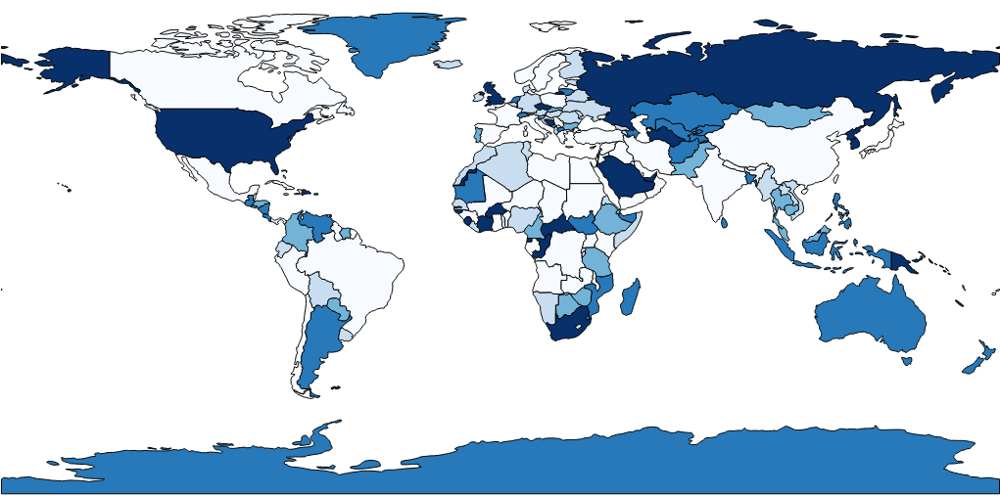

# fuzzy-spoon

- [code.csv](https://github.com/deep-j/fuzzy-spoon/blob/master/code.csv) contains the country name and corresponding country code.
The codes can be used for plotting on World Choropleth Map provided by plotly library.
